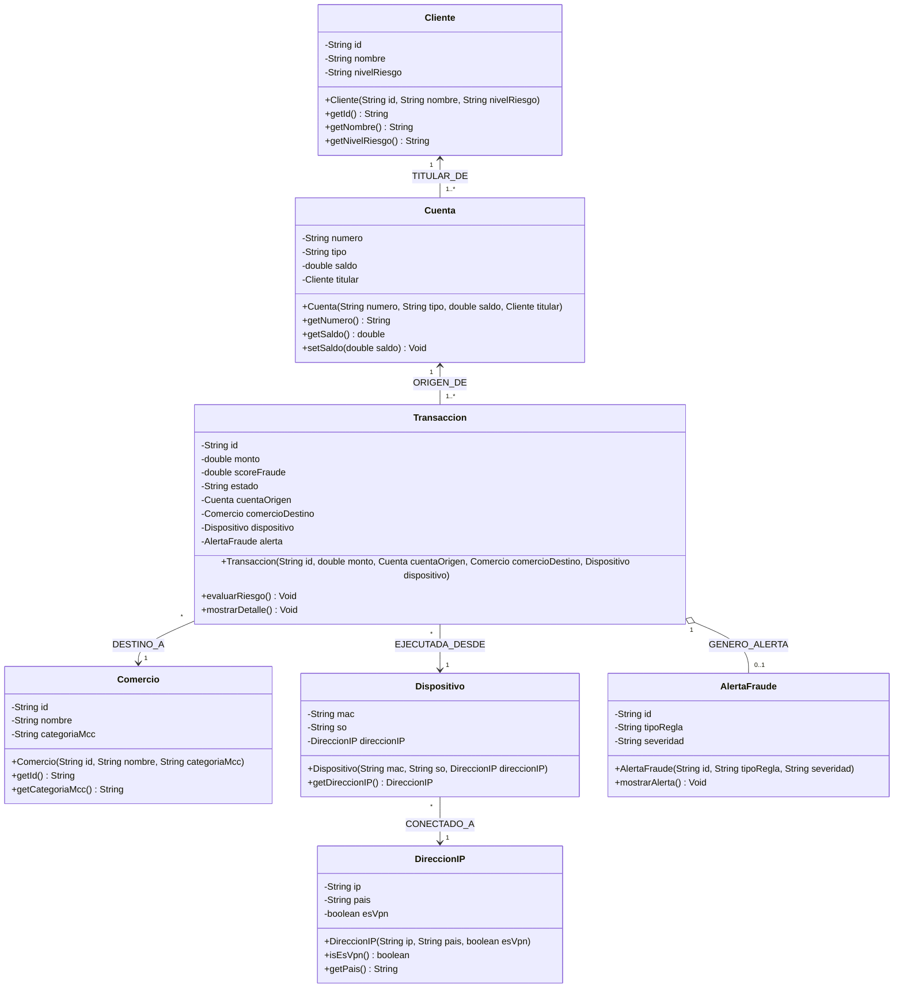

# analizador-fraudes-poo
Sistema de detección de fraudes financieros desarrollado en Java para la materia de Desarrollo de Software
## Diagrama de Clases UML

```mermaid
classDiagram
    class Cliente {
        -String id
        -String nombre
        -String nivelRiesgo
        +Cliente(String id, String nombre, String nivelRiesgo)
        +getId() String
        +getNombre() String
        +getNivelRiesgo() String
    }

    class Cuenta {
        -String numero
        -String tipo
        -double saldo
        -Cliente titular
        +Cuenta(String numero, String tipo, double saldo, Cliente titular)
        +getNumero() String
        +getSaldo() double
        +setSaldo(double saldo) Void
    }

    class Comercio {
        -String id
        -String nombre
        -String categoriaMcc
        +Comercio(String id, String nombre, String categoriaMcc)
        +getId() String
        +getCategoriaMcc() String
    }

    class DireccionIP {
        -String ip
        -String pais
        -boolean esVpn
        +DireccionIP(String ip, String pais, boolean esVpn)
        +isEsVpn() boolean
        +getPais() String
    }

    class Dispositivo {
        -String mac
        -String so
        -DireccionIP direccionIP
        +Dispositivo(String mac, String so, DireccionIP direccionIP)
        +getDireccionIP() DireccionIP
    }

    class AlertaFraude {
        -String id
        -String tipoRegla
        -String severidad
        +AlertaFraude(String id, String tipoRegla, String severidad)
        +mostrarAlerta() Void
    }

    class Transaccion {
        -String id
        -double monto
        -double scoreFraude
        -String estado
        -Cuenta cuentaOrigen
        -Comercio comercioDestino
        -Dispositivo dispositivo
        -AlertaFraude alerta
        +Transaccion(String id, double monto, Cuenta cuentaOrigen, Comercio comercioDestino, Dispositivo dispositivo)
        +evaluarRiesgo() Void
        +mostrarDetalle() Void
    }

    Cliente "1" <-- "1..*" Cuenta : TITULAR_DE
    Cuenta "1" <-- "1..*" Transaccion : ORIGEN_DE
    Transaccion "*" --> "1" Comercio : DESTINO_A
    Transaccion "*" --> "1" Dispositivo : EJECUTADA_DESDE
    Dispositivo "*" --> "1" DireccionIP : CONECTADO_A
    Transaccion "1" o-- "0..1" AlertaFraude : GENERO_ALERTA
```
